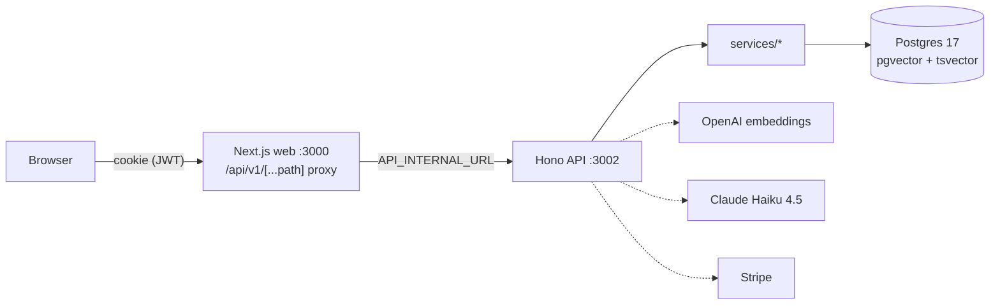

# Company's Brain — Technical Handover

> **Audience:** the next developer.
> **Last verified:** 2026-07-20, commit `d18e218`.
> This document does **not** duplicate the repo docs. `README.md` (setup) and `CLAUDE.md` (conventions, schema, API routes, env vars, retrieval rules) were audited line-by-line against the code on the date above and are the source of truth for those topics. This document adds what the repo can't tell you: orientation, workflow, known issues, and roadmap.

## Contents

- [Part I — System Architecture](#part-i--system-architecture)
- [Part II — Developer Guide](#part-ii--developer-guide)
- [Part III — Known Issues & Limitations](#part-iii--known-issues--limitations)
- [Part IV — Roadmap](#part-iv--roadmap)

---

# Part I — System Architecture

## Shape of the system

A Bun monorepo with three deployable pieces and a services layer:

| Piece | Tech | Role |
|---|---|---|
| `apps/web` | Next.js 15 | UI + **API proxy**: all browser calls go to Next.js routes (`/api/v1/[...path]`), which forward to the Hono API server-side. The API is never exposed to the browser. |
| `apps/api` | Hono on Bun, port 3002 | Routes, Zod validation, JWT auth middleware, org-isolation middleware. No business logic. |
| `services/*` | Plain TS packages | All business logic: `ingestion`, `retrieval`, `synthesis`, `access-control`, `payments`. Services never import each other — composition happens in routes/workers. |
| `workers/` | node-cron | `ingestion-retry` (03:00), `query-log-purge` (03:30), `org-data-purge` (04:00). `re-embed-worker` is manual-only. |
| `db/` | Drizzle + Postgres 17 (`pgvector/pgvector:pg17`) | Schema (one file per table), migrations, `init.sql` (extensions), `post-migrate.sql` (HNSW/GIN indexes). |

> 📊 **[DIAGRAM: keep the mermaid above, or redraw in Excalidraw for the PDF export]**

## Auth

- `POST /api/v1/auth/login` verifies the password and sets an **HttpOnly cookie** containing a hand-rolled HS256 JWT (`apps/api/src/lib/jwt.ts` — `node:crypto`, no auth library).
- `authMiddleware` (`apps/api/src/middleware/auth.ts`) validates the token and puts `userId` / `orgId` / `role` on the request context.
- `orgIsolationMiddleware` rejects any request where the URL's `:id` doesn't match the token's `orgId` — this is the tenant-isolation backstop for every org-scoped route.
- Role → permission mapping lives in `shared/constants.ts` (`ROLE_PERMISSIONS`, `hasPermission`). Routes check permissions explicitly.

## The RAG pipeline 

Two AI touchpoints only, both in `services/synthesis`:

1. **`contextualizeQuery`** — only when the request has conversation `history`: rewrites the follow-up into a standalone search query (Claude Haiku).
2. **`synthesizeAnswer`** — writes the answer from retrieved chunks only, with citations (Claude Haiku 4.5, `SYNTHESIS_MODEL` in `shared/constants.ts`).

Retrieval (`services/retrieval`) is deterministic:

- Question embedded with `text-embedding-3-large` (1536 dims).
- Two searches in parallel: pgvector cosine (HNSW index) and Postgres full-text (`websearch_to_tsquery`, terms OR-ed).
- Ranked lists fused with **Reciprocal Rank Fusion**: `score = Σ 1/(60 + rank)`. No LLM reranking.
- **Confidence** = best cosine similarity in the top k (k = 5). Below **0.25** → the API returns "I don't know" without calling the model. *Exception:* the gate is **skipped when `history` is present**, so follow-ups like "summarise that" reach synthesis — which is still RAG-only and refuses if the chunks lack the answer.
- Access control is applied in SQL and via `services/access-control` (visibility JSONB + restricted-compartment grants) **before** anything reaches the model.

Full scoring rules and the do-not-change-without-benchmarking policy: `CLAUDE.md` → "Retrieval scoring".

## Ingestion

`services/ingestion/index.ts`: extract text (`pdf-parse` / `mammoth` / UTF-8 fallback) → paragraph-aware chunking (2000 chars, 200 overlap) → SHA-256 dedup per org → embed in batches of 20 → insert chunks. Runs **synchronously inside the upload request** (see Known Issues). Failed documents are retried nightly via `ingestion_jobs`.

## Payments

`services/payments` wraps all Stripe logic: org subscription, Connect onboarding, external-client checkout with `application_fee_percent` (the 15% platform fee), billing portal, and the webhook handler (signature-verified, idempotent via the `stripe_events` table). Cancellation sets `orgs.cancelled_at`, which starts the 30-day quarantine clock consumed by `org-data-purge`.

## Data model

Full schema in `CLAUDE.md` → "Database Schema" (verified current). The two things to internalise:

- **Everything is scoped by `org_id`**, and every query filters it first. The unusual tables are `groups` / `group_members` / `compartment_grants` (restricted-compartment access) and chunk `visibility` JSONB (`allowedRoles` / `deniedRoles` / `allowedPrincipals` / `classification`).
- **JSONB columns must use `db/schema/jsonb.ts`**, never `jsonb` from `drizzle-orm/pg-core` — the pg-core one double-encodes with postgres.js. This bug has bitten before (fixed in migration `0008`).

---

# Part II — Developer Guide

## Setup

Follow `README.md` top to bottom — it was verified step-by-step against the code on 2026-07-20. Don't improvise around it.

## Local-dev traps (learned the hard way)

1. **Two Postgres containers compete for port 5432** on this machine (this project + the Marketing Tool). If migrations or queries hit the wrong database, run `docker ps` and check which container owns 5432 before debugging anything else.
2. **Never run `bun run build` while the dev server is running** — it corrupts `.next` chunks. The `prebuild` script now clears `.next` automatically, but don't run them concurrently.
3. `docker compose up -d` (without `db`) also builds the api/web production containers — in local dev you only want `docker compose up -d db`.

## Branch and deploy workflow

- `main` — default branch, PRs target this.
- `Production` — deployed branch on Coolify (no automatic CD setup due to missing github webhook)
- **There is no CI.** Run `bun test` locally before pushing; run `bun scripts/eval-retrieval.ts` before merging anything touching retrieval/chunking.

## The golden-set eval

`scripts/eval-retrieval.ts` runs real questions from `scripts/golden-set.json` against the local DB and reports retrieval quality. It exists so retrieval changes are measured, not vibes-checked. Workflow: run before your change (baseline) → change → run after → compare. Requires local DB + `OPENAI_API_KEY`. Add new golden questions when a real user query fails.

## Guided tour: one query, end to end

The best way to learn the codebase is to trace a chat question:

1. **`apps/web/src/app/(dashboard)/chat/page.tsx`** — submits `{ query, accessTier, history }` to `/api/v1/orgs/:id/query`.
2. **`apps/web/src/app/api/v1/[...path]/route.ts`** — Next.js proxy forwards it (with the cookie) to the Hono API at `API_INTERNAL_URL`.
3. **`apps/api/src/index.ts`** — mounts middleware: `authMiddleware` → `orgIsolationMiddleware` → routes.
4. **`apps/api/src/routes/query.ts`** — validates with Zod; if `history` present, calls `contextualizeQuery`; calls `retrieveChunks`; applies the confidence gate; calls `synthesizeAnswer`; logs the query row; returns `{ answer, citations, confidence, missing }`.
5. **`services/retrieval/index.ts`** — the parallel searches, RRF fusion, access filtering.
6. **`services/synthesis/index.ts`** — the Claude call and citation assembly.

Repeat the exercise for an upload (`routes/documents.ts` → `services/ingestion`) and you've seen 80% of the system's patterns.

## Conventions

All in `CLAUDE.md` → "Coding Conventions", "Agent Instructions". The load-bearing ones: services return `{ success, data | error }` and never throw across boundaries; routes orchestrate only; no new abstractions (repositories/factories/DI/event buses) — the codebase is deliberately plain.

---

# Part III — Known Issues & Limitations

All verified against the code at commit `d18e218`. Ordered by how likely they are to surprise you.

| # | Issue | Impact | Where it lands |
|---|---|---|---|
| 1 | **Small-to-big retrieval is a no-op.** The expansion query exists (`services/retrieval/index.ts` ~line 212) but ingestion never sets `parent_chunk_id`, so it never fires. | Answers can lose surrounding context (the caveat after a policy, the heading above a table). | Set `parent_chunk_id` during ingestion (needs section-aware chunking first — see Roadmap). |
| 2 | **Chunking is context-free.** Fixed ~2000-char paragraph windows; no document title, summary, or section path is prepended before embedding. A chunk from page 40 embeds as bare text with no idea what document it's from. | Retrieval quality ceiling; the main planned quality lever. | `services/ingestion` `chunkText`. **Benchmark with the golden set before/after — this is mandatory.** |
| 3 | **Ingestion is synchronous in the upload request.** `routes/documents.ts` calls `ingestDocument` inline; the HTTP request blocks through parsing + embedding. | Large documents = very slow uploads; risk of timeouts. Violates the repo's own "background work in workers only" rule. | Queue via `ingestion_jobs` + a worker instead. |
| 4 | **Org-wide chunk dedup can silently skip content.** Dedup checks the chunk hash against the *whole org*, not the document. Re-uploading the same file to a different compartment creates a document with **0 chunks** that still shows "complete". | Confusing admin experience; content can appear missing from the second compartment. | `services/ingestion/index.ts` dedup step. |
| 5 | **No CI.** Tests exist (`bun test`: access-control, ingestion, auth middleware) but nothing runs them automatically. | Regressions reach `Production` unchecked. | Add a GitHub Actions workflow (test + typecheck). |
| 6 | **Re-embedding is manual.** `workers/re-embed-worker.ts` is not cron-scheduled; if the embedding model ever changes, someone must run it by hand. | Stale embeddings after a model change. | Documented in `CLAUDE.md` workers table. |
| 7 | **Document versioning is partially wired.** `documents.version` / `previous_version_id` columns exist, but `TODO(Tori): verify whether the changed-content → new-version → archive-previous flow described in CLAUDE.md is actually implemented in the upload route — I could not confirm it in the code.` | Unclear behaviour when uploading a changed version of an existing doc. | `routes/documents.ts` + `services/ingestion`. |
| 8 | **Chat toolbar placeholders.** "Attach file", "Web search", "AI settings" buttons show "coming soon" toasts. | Cosmetic; users may click them expecting features. | `apps/web/.../chat/page.tsx` ~line 325. |
| 9 | **`NEXT_PUBLIC_API_URL` is legacy.** Referenced in docker-compose as a build arg but unused by the web code (everything goes through the proxy). | Confusing env surface; safe to remove after verifying the Dockerfile. | `docker-compose.yml`, `apps/web/Dockerfile`. |

Compliance-relevant note: the retention guarantees (90-day query-log purge, 30-day org quarantine) are implemented in `workers/retention.ts` **but only hold if the workers process is actually running in production** — verify per `03_Operations_and_Access.md`.

# Part IV — Roadmap

In priority order (my recommendation — reprioritise freely):

1. **Contextual chunking** (fixes #2, enables #1). Prepend document title/section context to each chunk before embedding; set `parent_chunk_id` for small-to-big expansion. Run the golden-set eval before and after; extend the golden set first if coverage is thin.
2. **Async ingestion** (fixes #3). Upload route writes the file + creates an `ingestion_jobs` row; a worker processes it; the documents page already polls status.
3. **CI pipeline** (fixes #5). GitHub Actions: `bun test` + `tsc --noEmit` on PRs; block merge on failure.
4. **Per-document dedup scope** (fixes #4), or at minimum surface "0 chunks created (duplicate content)" to the admin.
5. **Document versioning** — finish or explicitly descope (#7).
6. `TODO(Tori): anything promised to Equest or in the PRD that isn't listed above — attach or link the PRD here.`
