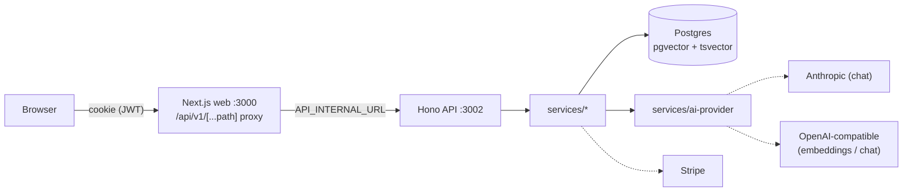

# Company's Brain — Technical Handover

> **Audience:** the next developer.
> This document does **not** duplicate the repo docs. `README.md` (setup) and `CLAUDE.md` (conventions, schema, API routes, env vars, retrieval rules) are the source of truth for those topics. This document adds what the repo can't tell you: orientation, workflow, known issues, and roadmap.

## Contents

- [Part I — System Architecture](#part-i--system-architecture)
- [Part II — Developer Guide](#part-ii--developer-guide)
- [Part III — Known Issues & Limitations](#part-iii--known-issues--limitations)
- [Part IV — Roadmap](#part-iv--roadmap)

---

# Part I — System Architecture

## Shape of the system

A Bun monorepo with three deployable pieces and a services layer:

| Piece | Tech | Role |
|---|---|---|
| `apps/web` | Next.js 15 | UI and **API proxy**: all browser calls go to Next.js routes (`/api/v1/[...path]`), which forward to the Hono API server-side. The API is never exposed to the browser. |
| `apps/api` | Hono on Bun, port 3002 | Routes, Zod validation, JWT auth middleware, org-isolation middleware. No business logic. |
| `services/*` | Plain TS packages | All business logic: `ingestion`, `retrieval`, `synthesis`, `access-control`, `ai-provider`, `payments`. Services never import each other — composition happens in routes and workers. |
| `workers/` | node-cron | `ingestion-retry` (03:00), `query-log-purge` (03:30), `org-data-purge` (04:00), plus a manual `re-embed`. Runs as a single long-lived Bun process, separate from `api`/`web`. See "Workers" below and `03_Operations_and_Access.md` §1 for its deployment status. |
| `db/` | Drizzle + Postgres (`pgvector/pgvector:pg16`) | Schema (one file per table), migrations, `init.sql` (extensions), `post-migrate.sql` (HNSW/GIN indexes). |

```mermaid
flowchart LR
    B[Browser] -->|"cookie (JWT)"| W["Next.js web :3000<br/>/api/v1/[...path] proxy"]
    W -->|API_INTERNAL_URL| A["Hono API :3002"]
    A --> S["services/*"]
    S --> P[("Postgres<br/>pgvector + tsvector")]
    S --> AIP["services/ai-provider"]
    AIP -.-> ANT["Anthropic (chat)"]
    AIP -.-> OAI["OpenAI-compatible<br/>(embeddings / chat)"]
    S -.-> STR["Stripe"]
```

> 📊 **[DIAGRAM: keep the mermaid above, or redraw in Excalidraw for the PDF export]**

## Auth

- `POST /api/v1/auth/login` verifies the password and sets an **HttpOnly cookie** containing a hand-rolled HS256 JWT (`apps/api/src/lib/jwt.ts` — `node:crypto`, no auth library). `rememberMe` extends the cookie lifetime.
- `authMiddleware` (`apps/api/src/middleware/auth.ts`) validates the token and puts `userId` / `orgId` / `role` on the request context.
- `orgIsolationMiddleware` rejects any request where the URL's `:id` doesn't match the token's `orgId` — this is the tenant-isolation backstop for every org-scoped route.
- Role → permission mapping lives in `shared/constants.ts` (`ROLE_PERMISSIONS`, `hasPermission`). Routes check permissions explicitly.
- Invited users carry a `must_change_password` flag; login reports it, the app forces a password change, and `PATCH /orgs/:id/account/password` clears it. Forgotten passwords go through `POST /auth/forgot-password` → emailed single-use link → `POST /auth/reset-password`, backed by the `password_reset_tokens` table.

## The AI provider layer

`services/ai-provider` is the single place that constructs an AI SDK client. It exposes two capability interfaces — `ChatProvider` and `EmbeddingProvider` — and selects an implementation from environment variables:

- **Chat:** `anthropic` (default) or `openai-compatible`. `openai-compatible` targets OpenAI or any local runtime (Ollama, vLLM, LM Studio, llama.cpp) via `AI_CHAT_BASE_URL`.
- **Embeddings:** `openai-compatible` — OpenAI by default, or a local endpoint via `AI_EMBEDDING_BASE_URL`.

Defaults preserve the previous hardcoded behaviour: chat model `claude-haiku-4-5-20251001`, embedding model `text-embedding-3-large` at 1536 dimensions. `services/retrieval`, `services/ingestion`, `services/synthesis`, and `workers/re-embed-worker` consume the interfaces via `getChatProvider()` / `getEmbeddingProvider()` — never the SDKs directly. Config parsing, base-URL security checks, and error normalisation all live in this package (`config.ts`, `errors.ts`, `embedding-validator.ts`). `validateAiConfig()` runs at startup in both the API (`apps/api/src/index.ts`) and the workers process, so a bad configuration fails fast. Full env-var reference is in `CLAUDE.md` → "Environment Variables".

## The RAG pipeline

Two AI touchpoints only, both in `services/synthesis`:

1. **`contextualizeQuery`** — only when the request has conversation `history`: rewrites the follow-up into a standalone search query via the chat provider.
2. **`synthesizeAnswer`** — writes the answer from retrieved chunks only, with citations, via the chat provider.

Retrieval (`services/retrieval`) is deterministic:

- Question embedded through the embedding provider (`text-embedding-3-large`, 1536 dims by default).
- Two searches in parallel: pgvector cosine (HNSW index) and Postgres full-text (`websearch_to_tsquery`, terms OR-ed).
- Ranked lists fused with **Reciprocal Rank Fusion**: `score = Σ 1/(60 + rank)`. No LLM reranking.
- **Confidence** = best cosine similarity in the top k (k = 5). Below **0.25** (`CONFIDENCE_GATE_THRESHOLD` in `shared/constants.ts`) the API returns "I don't know" without calling the model. *Exception:* the gate is **skipped when `history` is present**, so follow-ups like "summarise that" reach synthesis — which is still RAG-only and refuses if the chunks lack the answer.
- Access control is applied in SQL and via `services/access-control` (visibility JSONB + restricted-compartment grants) **before** anything reaches the model.

Full scoring rules and the do-not-change-without-benchmarking policy: `CLAUDE.md` → "Retrieval scoring".

## Ingestion

`services/ingestion/index.ts`: extract text (`pdf-parse` / `mammoth` / UTF-8 fallback) → paragraph-aware chunking (2000 chars, 200 overlap) → SHA-256 dedup per org → embed in batches of 20 through the embedding provider → insert chunks. Runs **synchronously inside the upload request** (see Known Issues). When a changed file is re-uploaded under the same name and compartment, `routes/documents.ts` archives the previous document's chunks and inserts a new record with an incremented `version` and a `previous_version_id` back-link. Failed documents are recorded in `ingestion_jobs`.

## Payments

`services/payments` wraps all Stripe logic: org subscription, Connect onboarding, external-client checkout with `application_fee_percent` (the 15% platform fee), billing portal, and the webhook handler (signature-verified, idempotent via the `stripe_events` table). Cancellation sets `orgs.cancelled_at`, which starts the 30-day quarantine clock consumed by `org-data-purge`.

## Workers

The `workers/` package is a single long-running Bun process (`bun run workers` → `workers/index.ts`) that registers three `node-cron` jobs, plus one manual function. **This process is not currently deployed** (only the `web` and `api` Coolify apps and Dockerfiles exist) — see `03_Operations_and_Access.md` §1 for the compliance impact.

| Job | Schedule | What it does | Status |
|---|---|---|---|
| `query-log-purge` (`retention.ts`) | daily 03:30 | Deletes `queries` rows older than `QUERY_LOG_RETENTION_DAYS` (90). | Works. Compliance-mandated (`CLAUDE.md` Hard Constraint #7). |
| `org-data-purge` (`retention.ts`) | daily 04:00 | Finds orgs with `cancelled_at` older than `ORG_QUARANTINE_DAYS` (30) and hard-deletes them; FK CASCADE removes users/documents/chunks/queries/audit_logs. | Works. Compliance-mandated (right-to-erasure). |
| `ingestion-retry` (`ingestion-retry.ts`) | daily 03:00 | For each failed `ingestion_jobs` row it marks the job `running`, logs that file re-fetch is not implemented, and marks it `failed` again, incrementing `retry_count` until `max_retries` (3). It cannot re-ingest because v1 does not persist the uploaded file to re-read. | Inert no-op. Becomes real only once uploads are stored (object storage) — tie to the async-ingestion roadmap item. |
| `re-embed` (`re-embed-worker.ts`) | manual only | Re-embeds every active chunk in batches of 10. Run with `bun run re-embed`. | Works. Manual by design — never schedule it; it rewrites every embedding. |

**Why re-embed matters:** the AI-provider layer makes the embedding model swappable via `AI_EMBEDDING_MODEL` / `AI_EMBEDDING_DIMENSIONS`. Changing either leaves all existing embeddings stale (or the wrong vector width), silently degrading search. `bun run re-embed` is the remedy — run it after any embedding-model change, then re-run the golden-set eval.

**Deployment gap:** because the workers process isn't running in production, `query-log-purge` and `org-data-purge` are **not executing** — a live compliance gap, not just tech debt. Fixing it means running `bun run workers` as a real process in prod (a third Coolify app, a systemd unit / cron on the VPS, or folding a scheduler into an existing app). Tracked in `03_Operations_and_Access.md` §1 and §7.

## Data model

Full schema in `CLAUDE.md` → "Database Schema"; migrations run `0000`–`0014`. The two things to internalise:

- **Everything is scoped by `org_id`**, and every query filters it first. The unusual tables are `groups` / `group_members` / `compartment_grants` (restricted-compartment access) and chunk `visibility` JSONB (`allowedRoles` / `deniedRoles` / `allowedPrincipals` / `classification`).
- **JSONB columns must use `db/schema/jsonb.ts`**, never `jsonb` from `drizzle-orm/pg-core` — the pg-core one double-encodes with postgres.js. This bug has bitten before (fixed in migration `0008`).

---

# Part II — Developer Guide

## Setup

Follow `README.md` top to bottom. Don't improvise around it.

## Local-dev traps (learned the hard way)

1. **Two Postgres containers compete for port 5432** on this machine (this project plus the Marketing Tool). If migrations or queries hit the wrong database, run `docker ps` and check which container owns 5432 before debugging anything else.
2. **Never run `bun run build` while the dev server is running** — it corrupts `.next` chunks. The `prebuild` script clears `.next` automatically, but don't run them concurrently.
3. `docker compose up -d` (without `db`) also builds the api/web production containers — in local dev you only want `docker compose up -d db`.

## Branch and deploy workflow

- `main` — default branch; PRs target this.
- `Production` — the deployed branch on Coolify. Deploys are manual (no GitHub webhook) — see `03_Operations_and_Access.md` §2.
- **There is no CI.** Run `bun test` locally before pushing; run `bun scripts/eval-retrieval.ts` before merging anything touching retrieval or chunking.

## The golden-set eval

`scripts/eval-retrieval.ts` runs real questions from `scripts/golden-set.json` against the local DB and reports retrieval quality. It exists so retrieval changes are measured, not vibes-checked. Workflow: run before your change (baseline) → change → run after → compare. Requires a local DB and `OPENAI_API_KEY`. Add new golden questions when a real user query fails.

## Guided tour: one query, end to end

The best way to learn the codebase is to trace a chat question:

1. **`apps/web/src/app/(dashboard)/chat/page.tsx`** — submits `{ query, accessTier, history }` to `/api/v1/orgs/:id/query`.
2. **`apps/web/src/app/api/v1/[...path]/route.ts`** — the Next.js proxy forwards it (with the cookie) to the Hono API at `API_INTERNAL_URL`.
3. **`apps/api/src/index.ts`** — mounts middleware: `authMiddleware` → `orgIsolationMiddleware` → routes.
4. **`apps/api/src/routes/query.ts`** — validates with Zod; if `history` is present, calls `contextualizeQuery`; calls `retrieveChunks`; applies the confidence gate; calls `synthesizeAnswer`; logs the query row; returns `{ answer, citations, confidence, missing }`.
5. **`services/retrieval/index.ts`** — the parallel searches, RRF fusion, access filtering.
6. **`services/synthesis/index.ts`** — the chat-provider call and citation assembly.

Repeat the exercise for an upload (`routes/documents.ts` → `services/ingestion`) and you've seen 80% of the system's patterns.

## Conventions

All in `CLAUDE.md` → "Coding Conventions" and "Agent Instructions". The load-bearing ones: services return `{ success, data | error }` and never throw across boundaries; routes orchestrate only; no new abstractions (repositories/factories/DI/event buses) — the codebase is deliberately plain.

---

# Part III — Known Issues & Limitations

Ordered by how likely they are to surprise you.

| # | Issue | Impact | Where it lands |
|---|---|---|---|
| 1 | **Small-to-big retrieval is a no-op.** The expansion query exists (`services/retrieval/index.ts`, `expandToParent`) but ingestion never sets `parent_chunk_id`, so it never fires. | Answers can lose surrounding context (the caveat after a policy, the heading above a table). | Set `parent_chunk_id` during ingestion (needs section-aware chunking first — see Roadmap). |
| 2 | **Chunking is context-free.** Fixed ~2000-char paragraph windows; no document title, summary, or section path is prepended before embedding. A chunk from page 40 embeds as bare text with no idea what document it's from. | Retrieval quality ceiling; the main planned quality lever. | `services/ingestion` `chunkText`. **Benchmark with the golden set before and after — this is mandatory.** |
| 3 | **Ingestion is synchronous in the upload request.** `routes/documents.ts` calls `ingestDocument` inline; the HTTP request blocks through parsing and embedding. | Large documents make for very slow uploads and risk timeouts. Violates the repo's own "background work in workers only" rule. | Queue via `ingestion_jobs` + a worker instead. |
| 4 | **Org-wide chunk dedup can silently skip content.** Dedup checks the chunk hash against the *whole org*, not the document. Re-uploading the same content to a different compartment can create a document with **0 chunks** that still shows "complete". | Confusing admin experience; content can appear missing from the second compartment. | `services/ingestion/index.ts` dedup step. |
| 5 | **`ingestion-retry` worker is inert.** It re-marks failed jobs `failed` and burns `retry_count`; it can never re-ingest because v1 doesn't persist uploaded files. Compounded by #3. | No automatic recovery of failed ingestions; misleading retry counts. | Depends on storing uploads (object storage) — bundle with async ingestion (#3). See "Workers" in Part I. |
| 6 | **Workers process is not deployed.** Only `web` and `api` Coolify apps / Dockerfiles exist; nothing runs `bun run workers` in prod. | **Live compliance gap** — the 90-day and 30-day retention jobs are not running. | `03_Operations_and_Access.md` §1 & §7. |
| 7 | **Re-embedding is manual (by design).** `re-embed-worker.ts` is not cron-scheduled; run it with `bun run re-embed`. It matters more since the AI-provider layer made the embedding model swappable — changing `AI_EMBEDDING_MODEL`/dimensions requires running it or search silently degrades. | Stale embeddings after a model change. | See "Workers" in Part I. |
| 8 | **No CI.** Tests exist (`bun test`: access-control, ingestion, auth middleware, documents) but nothing runs them automatically. | Regressions reach `Production` unchecked. | Add a GitHub Actions workflow (test + typecheck). |
| 9 | **`NEXT_PUBLIC_API_URL` is legacy.** Referenced in `docker-compose.yml` and the web Dockerfile as a build arg but unused by the web code (everything goes through the proxy). It must stay **empty** in production — see `03_Operations_and_Access.md` §2. | Confusing env surface; setting it breaks auth. | `docker-compose.yml`, `apps/web/Dockerfile`. |
| 10 | **Prod runs on plain HTTP, so the `Secure` auth cookie is dropped and login silently fails** (200 on login, then bounced back — the cookie never stores). Worked around with `COOKIE_SECURE=false` on both apps, which sends the cookie without `Secure` — a security downgrade (session token in cleartext). | Login blocked on HTTP without the override; token sniffable with it. | **Real fix: enable TLS in Coolify** (the `*.sslip.io` domain can get a Let's Encrypt cert), then unset `COOKIE_SECURE`. See `03_Operations_and_Access.md` §2. |

Compliance-relevant note: the retention guarantees (90-day query-log purge, 30-day org quarantine) are implemented in `workers/retention.ts` but the workers process is not deployed, so these jobs are **not currently running in production**. This is a live compliance gap, tracked in `03_Operations_and_Access.md` §1 & §7.

# Part IV — Roadmap

In priority order (a recommendation — reprioritise freely):

0. **Deploy the workers process** (fixes #6 — do this first). The retention jobs are a compliance obligation that is currently not being met because nothing runs `bun run workers` in production. Cheapest fix: a third Coolify app (or a systemd unit / cron on the VPS) that runs the workers process. Verify in logs that `query-log-purge` and `org-data-purge` fire. Flag the gap to your manager in the meantime (§7 of the Ops doc).
1. **Contextual chunking** (fixes #2, enables #1). Prepend document title / section context to each chunk before embedding; set `parent_chunk_id` for small-to-big expansion. Run the golden-set eval before and after; extend the golden set first if coverage is thin.
2. **Async ingestion** (fixes #3 and #5). Upload route writes the file and creates an `ingestion_jobs` row; a worker processes it; the documents page already polls status.
3. **CI pipeline** (fixes #8). GitHub Actions: `bun test` + `tsc --noEmit` on PRs; block merge on failure.
4. **Per-document dedup scope** (fixes #4), or at minimum surface "0 chunks created (duplicate content)" to the admin.
5. **Query feedback ("was this helpful").** There is no `helpful`-style column on `queries` (`db/schema/queries.ts`) and no feedback endpoint. To build it: add a nullable `helpful` boolean column via migration, a small `PATCH /orgs/:id/query/:queryId/feedback` route following the route-handler/service split in `CLAUDE.md`, and a chat-page control that calls it and reflects saved state. The unanswered/low-confidence data already surfaces in Analytics.
6. **PRD alignment.** Reconcile this roadmap against anything promised to Equest or in the PRD. The PRD itself is **not verifiable from the current codebase** — link or attach it here once located.
