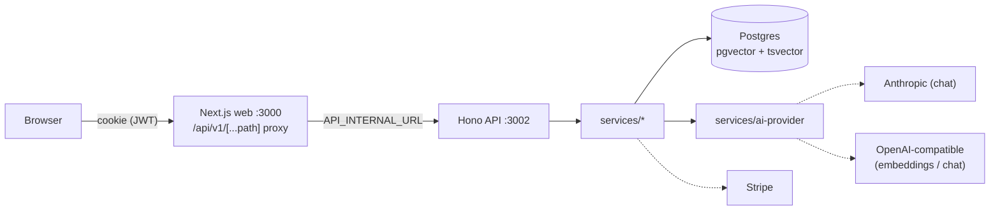

# Company's Brain — Technical Handover

> **Audience:** the next developer.
> This document does **not** duplicate the repo docs. `README.md` (setup) and `CLAUDE.md` (conventions, schema, API routes, env vars, retrieval rules) are the source of truth for those topics. This document adds what the repo can't tell you: orientation, workflow, known issues, roadmap, and how production is actually run.
>
> **Last verified against the code:** 2026-08-11 (branch `docs-storage`, migrations `0000`–`0019`).
>
> **Secrets and access are deliberately out of scope.** Env-var *names* and what they configure are in `CLAUDE.md`; their *values* are shared offline and live in the Coolify app config. VPS and account access is owned directly by the business, so this document records no credentials, no SSH details, and no account inventory.

## Contents

- [Part I — System Architecture](#part-i--system-architecture)
- [Part II — Developer Guide](#part-ii--developer-guide)
- [Part III — Known Issues & Limitations](#part-iii--known-issues--limitations)
- [Part IV — Roadmap](#part-iv--roadmap)
- [Part V — Production Operations](#part-v--production-operations)
- [Appendix A — OCR for scanned documents (designed, not built)](#appendix-a--ocr-for-scanned-documents-designed-not-built)

---

# Part I — System Architecture

## Shape of the system

A Bun monorepo with three deployable pieces and a services layer:

| Piece | Tech | Role |
|---|---|---|
| `apps/web` | Next.js 15 | UI and **API proxy**: all browser calls go to Next.js routes (`/api/v1/[...path]`), which forward to the Hono API server-side. The API is never exposed to the browser. |
| `apps/api` | Hono on Bun, port 3002 | Routes, Zod validation, JWT auth middleware, org-isolation middleware. No business logic. |
| `services/*` | Plain TS packages | All business logic: `ingestion`, `retrieval`, `synthesis`, `access-control`, `ai-provider`, `storage`, `payments`. Services never import each other — composition happens in routes and workers. |
| `workers/` | node-cron | `ingestion-retry` (03:00), `query-log-purge` (03:30), `org-data-purge` (04:00), plus a manual `re-embed`. Runs as a single long-lived Bun process, separate from `api`/`web`. See "Workers" below and Part V for its deployment status. |
| `db/` | Drizzle + Postgres (`pgvector/pgvector:pg16`) | Schema (one file per table), migrations, `init.sql` (extensions), `post-migrate.sql` (HNSW/GIN indexes). |


```mermaid
flowchart LR
    B[Browser] -->|"cookie (JWT)"| W["Next.js web :3000<br/>/api/v1/[...path] proxy"]
    W -->|API_INTERNAL_URL| A["Hono API :3002"]
    A --> S["services/*"]
    S --> P[("Postgres<br/>pgvector + tsvector")]
    S --> AIP["services/ai-provider"]
    AIP -.-> ANT["Anthropic (chat)"]
    AIP -.-> OAI["OpenAI-compatible<br/>(embeddings / chat)"]
    S -.-> STR["Stripe"]
```

> 📊 **[DIAGRAM: keep the mermaid above, or redraw in Excalidraw for the PDF export]**

## Auth

- `POST /api/v1/auth/login` verifies the password and sets an **HttpOnly cookie** containing a hand-rolled HS256 JWT (`apps/api/src/lib/jwt.ts` — `node:crypto`, no auth library). **Every session is 8 hours regardless of role** (`SESSION_TTL_SECONDS`, `shared/constants.ts`); there is no "remember me". Login is rate-limited per email **and** per IP (`apps/api/src/lib/rate-limit.ts`).
- `authMiddleware` (`apps/api/src/middleware/auth.ts`) validates the token and puts `userId` / `orgId` / `role` on the request context. It **re-checks the user on every request** — existence, live role, and `users.session_invalidated_at` — so removing a user, changing their role, or resetting their password revokes their session immediately rather than at token expiry. Tokens issued before `session_invalidated_at` are rejected.
- `orgIsolationMiddleware` rejects any request where the URL's `:id` doesn't match the token's `orgId` — this is the tenant-isolation backstop for every org-scoped route.
- **Permissions are per-org and editable at runtime.** `ROLE_PERMISSIONS` in `shared/constants.ts` is only the *seed default*; the live matrix lives in the `role_permissions` table and is resolved by `services/access-control/role-permissions.ts` (`hasPermission(orgId, role, permission)` — **async, cached per org**). Org admins edit it via `GET`/`PUT /orgs/:id/roles`. Routes await this function; the synchronous `hasPermission(role, permission)` still exported from `shared/constants.ts` is the defaults-only variant — **don't use it in routes.**
  - Two guards constrain what the matrix can express: role assignment is bounded by `ROLE_RANK` (you can only assign a role strictly below your own), and *locked* permissions (`orgs:manage`, `roles:manage`) are never grantable and stay pinned to super/org admin.
  - **Layer-2 admin invariant:** `org_admin` and `super_admin` always have full data reach within their org — every compartment, both tiers — enforced by hardcoded role checks at four sites, *not* by the matrix. Removing `documents:view` from `org_admin` hides UI; it does not restrict what they can retrieve. Full detail in `CLAUDE.md` → "Admin data-access invariant". Never describe the matrix to a customer as a way to sandbox an org admin.
- Invited users carry a `must_change_password` flag; login reports it, the app forces a password change, and `PATCH /orgs/:id/account/password` clears it. Forgotten passwords go through `POST /auth/forgot-password` → emailed single-use link → `POST /auth/reset-password`, backed by the `password_reset_tokens` table.

## The AI provider layer

`services/ai-provider` is the single place that constructs an AI SDK client. It exposes two capability interfaces — `ChatProvider` and `EmbeddingProvider` — and selects an implementation from environment variables:

- **Chat:** `anthropic` (default) or `openai-compatible`. `openai-compatible` targets OpenAI or any local runtime (Ollama, vLLM, LM Studio, llama.cpp) via `AI_CHAT_BASE_URL`.
- **Embeddings:** `openai-compatible` — OpenAI by default, or a local endpoint via `AI_EMBEDDING_BASE_URL`.

Defaults preserve the previous hardcoded behaviour: chat model `claude-haiku-4-5-20251001`, embedding model `text-embedding-3-large` at 1536 dimensions. `services/retrieval`, `services/ingestion`, `services/synthesis`, and `workers/re-embed-worker` consume the interfaces via `getChatProvider()` / `getEmbeddingProvider()` — never the SDKs directly. Config parsing, base-URL security checks, and error normalisation all live in this package (`config.ts`, `errors.ts`, `embedding-validator.ts`). `validateAiConfig()` runs at startup in both the API (`apps/api/src/index.ts`) and the workers process, so a bad configuration fails fast. Full env-var reference is in `CLAUDE.md` → "Environment Variables".

## The RAG pipeline

Two AI touchpoints only, both in `services/synthesis`:

1. **`contextualizeQuery`** — only when the request has conversation `history`: rewrites the follow-up into a standalone search query via the chat provider.
2. **`synthesizeAnswer`** — writes the answer from retrieved chunks only, with citations, via the chat provider.

Retrieval (`services/retrieval`) is deterministic:

- Question embedded through the embedding provider (`text-embedding-3-large`, 1536 dims by default).
- Two searches in parallel: pgvector cosine (HNSW index) and Postgres full-text (`websearch_to_tsquery`, terms OR-ed).
- Ranked lists fused with **Reciprocal Rank Fusion**: `score = Σ 1/(60 + rank)`. No LLM reranking.
- **Confidence** = best cosine similarity in the top k (k = 5). Below **0.25** (`CONFIDENCE_GATE_THRESHOLD` in `shared/constants.ts`) the API returns "I don't know" without calling the model. *Exception:* the gate is **skipped when `history` is present**, so follow-ups like "summarise that" reach synthesis — which is still RAG-only and refuses if the chunks lack the answer.
- Access control is applied in SQL and via `services/access-control` (visibility JSONB + restricted-compartment grants) **before** anything reaches the model.

Full scoring rules and the do-not-change-without-benchmarking policy: `CLAUDE.md` → "Retrieval scoring".

## Ingestion

`routes/documents.ts` first writes the uploaded bytes to `services/storage`, then calls `services/ingestion/index.ts`: extract text (`pdf-parse` / `mammoth` / UTF-8 fallback) → paragraph-aware chunking (2000 chars, 200 overlap) → SHA-256 dedup per org → embed in batches of 20 through the embedding provider → insert chunks. Runs **synchronously inside the upload request** (see Known Issues). When a changed file is re-uploaded under the same name and compartment, the route archives the previous document's chunks and inserts a new record with an incremented `version` and a `previous_version_id` back-link. Failed documents are recorded in `ingestion_jobs`.

Uploads are constrained to the extensions in `UPLOAD_MIME_TYPES` (`shared/constants.ts`): **`.pdf`, `.docx`, `.txt`, `.md`**. Legacy `.doc` is explicitly rejected with a "convert to .docx" message, and the frontend's accept list is derived from that same constant — add a format in one place.

**Document status is not just success/failure.** `ingestion_status` includes **`no_text`**: the file uploaded and stored intact, but nothing could be extracted (a scanned PDF, an image-only slide deck). This is *not* an error — it's a distinct state, shown in the UI as "No text found", and the retry worker deliberately skips it, because re-running the same parser over the same bytes finds the same nothing. Making these documents searchable needs OCR — see **Appendix A**, and note that `status = 'no_text'` is already the work queue for it.

## Original file storage

`services/storage` keeps every uploaded file byte-for-byte alongside its chunks, so a document can be viewed in its original formatting (`GET /orgs/:id/documents/:docId/file`) and re-parsed later without asking the admin to re-upload. This is what made `ingestion-retry` a real worker rather than a stub.

The load-bearing design rule is in the file header and worth preserving: **a storage key is always relative** — `{orgId}/{documentId}`, never an absolute path. The driver owns the prefix (a root directory today, a bucket later), so the same key works unchanged against the filesystem, S3, R2, or MinIO. Migrating backends is a file copy plus an env var; nothing in `documents.storage_key` changes. `STORAGE_DRIVER=s3` is the intended swap point and currently throws a descriptive "not implemented" error — Bun ships `Bun.S3Client`, so it needs no new dependency.

Two operational consequences, both easy to get wrong:

- **`STORAGE_ROOT` must be a persistent volume.** In Docker it's `/data/documents`. If the `api` container is redeployed without one, every stored original is gone (the chunks survive in Postgres, so search still works — which is exactly why the loss is easy to miss). See Part V → "Persistent storage".
- **No FK cascade reaches stored files.** Postgres cascades delete chunks and documents; they cannot touch the filesystem. Every deletion path — document delete, compartment delete, org purge — must call `services/storage` explicitly, or the "permanently deleted" compliance guarantee (`CLAUDE.md` Hard Constraint #7) is false. Check this whenever you add a deletion path.

Documents uploaded **before** this feature existed have `storage_key = NULL`. They can't be previewed in original form or retried automatically; they need a manual re-upload.

## Payments

`services/payments` wraps all Stripe logic: org subscription, Connect onboarding, external-client checkout with `application_fee_percent` (the 15% platform fee), billing portal, and the webhook handler (signature-verified, idempotent via the `stripe_events` table). Cancellation sets `orgs.cancelled_at`, which starts the 30-day quarantine clock consumed by `org-data-purge`.

## Workers

The `workers/` package is a single long-running Bun process (`bun run workers` → `workers/index.ts`) that registers three `node-cron` jobs, plus one manual function. **This process is not currently deployed** (only the `web` and `api` Coolify apps and Dockerfiles exist) — see Part V for the compliance impact.

| Job | Schedule | What it does | Status |
|---|---|---|---|
| `query-log-purge` (`retention.ts`) | daily 03:30 | Deletes `queries` rows older than `QUERY_LOG_RETENTION_DAYS` (90). | Works. Compliance-mandated (`CLAUDE.md` Hard Constraint #7). |
| `org-data-purge` (`retention.ts`) | daily 04:00 | Finds orgs with `cancelled_at` older than `ORG_QUARANTINE_DAYS` (30) and hard-deletes them; FK CASCADE removes users/documents/chunks/queries/audit_logs. | Works. Compliance-mandated (right-to-erasure). |
| `ingestion-retry` (`ingestion-retry.ts`) | daily 03:00 | For each failed `ingestion_jobs` row under `max_retries` (3): re-reads the stored original via `services/storage`, clears any partial chunks from the previous attempt, and re-runs `ingestDocument`. Skips `no_text` documents (marks the job complete — the parser would find the same nothing) and documents with no `storage_key`, which predate original-file storage and need a manual re-upload. | **Works** (since original-file storage shipped). Was an inert stub in earlier handover drafts. |
| `re-embed` (`re-embed-worker.ts`) | manual only | Re-embeds every active chunk in batches of 10. Run with `bun run re-embed`. | Works. Manual by design — never schedule it; it rewrites every embedding. |

**Why re-embed matters:** the AI-provider layer makes the embedding model swappable via `AI_EMBEDDING_MODEL` / `AI_EMBEDDING_DIMENSIONS`. Changing either leaves all existing embeddings stale (or the wrong vector width), silently degrading search. `bun run re-embed` is the remedy — run it after any embedding-model change, then re-run the golden-set eval.

**Deployment gap:** because the workers process isn't running in production, `query-log-purge` and `org-data-purge` are **not executing** — a live compliance gap, not just tech debt. Fixing it means running `bun run workers` as a real process in prod (a third Coolify app, a systemd unit / cron on the VPS, or folding a scheduler into an existing app). Tracked in Part V.

## Data model

Full schema in `CLAUDE.md` → "Database Schema"; migrations run `0000`–`0019`. Recent ones worth knowing: `0016` added `users.session_invalidated_at` (session revocation), `0018` added the `no_text` ingestion status, `0019` **removed `source_type`** from `documents` and `chunks` along with its enum. The three things to internalise:

- **Everything is scoped by `org_id`**, and every query filters it first. The unusual tables are `groups` / `group_members` / `compartment_grants` (restricted-compartment access) and chunk `visibility` JSONB (`allowedRoles` / `deniedRoles` / `allowedPrincipals` / `classification`).
- **JSONB columns must use `db/schema/jsonb.ts`**, never `jsonb` from `drizzle-orm/pg-core` — the pg-core one double-encodes with postgres.js. This bug has bitten before (fixed in migration `0008`).
- **Don't re-add `source_type`.** It was stored on documents and chunks and never read by anything downstream — added, "fixed" with a retrieval filter no frontend ever called, and finally removed in `0019`. Compartments (folders) already express the same categorisation and, unlike source_type, actually govern access and retrieval. It was dead weight twice; only bring it back with a concrete consumer.

---

# Part II — Developer Guide

## Setup

Follow `README.md` top to bottom. Don't improvise around it.

## Local-dev traps (learned the hard way)

1. **Two Postgres containers compete for port 5432** on this machine (this project plus the Marketing Tool). If migrations or queries hit the wrong database, run `docker ps` and check which container owns 5432 before debugging anything else.
2. **Never run `bun run build` while the dev server is running** — it corrupts `.next` chunks. The `prebuild` script clears `.next` automatically, but don't run them concurrently.
3. `docker compose up -d` (without `db`) also builds the api/web production containers — in local dev you only want `docker compose up -d db`.

## Branch and deploy workflow

- `main` — default branch; PRs target this.
- `Production` — the deployed branch on Coolify. Deploys are manual (no GitHub webhook) — see Part V.
- **There is no CI.** Run `bun test` locally before pushing; run `bun scripts/eval-retrieval.ts` before merging anything touching retrieval or chunking.

## The golden-set eval

`scripts/eval-retrieval.ts` runs real questions from `scripts/golden-set.json` against the local DB and reports retrieval quality. It exists so retrieval changes are measured, not vibes-checked. Workflow: run before your change (baseline) → change → run after → compare. Requires a local DB and `OPENAI_API_KEY`. Add new golden questions when a real user query fails.

## Guided tour: one query, end to end

The best way to learn the codebase is to trace a chat question:

1. **`apps/web/src/app/(dashboard)/chat/page.tsx`** — submits `{ query, accessTier, history }` to `/api/v1/orgs/:id/query`.
2. **`apps/web/src/app/api/v1/[...path]/route.ts`** — the Next.js proxy forwards it (with the cookie) to the Hono API at `API_INTERNAL_URL`.
3. **`apps/api/src/index.ts`** — mounts middleware: `authMiddleware` → `orgIsolationMiddleware` → routes.
4. **`apps/api/src/routes/query.ts`** — validates with Zod; if `history` is present, calls `contextualizeQuery`; calls `retrieveChunks`; applies the confidence gate; calls `synthesizeAnswer`; logs the query row; returns `{ answer, citations, confidence, missing }`.
5. **`services/retrieval/index.ts`** — the parallel searches, RRF fusion, access filtering.
6. **`services/synthesis/index.ts`** — the chat-provider call and citation assembly.

Repeat the exercise for an upload (`routes/documents.ts` → `services/ingestion`) and you've seen 80% of the system's patterns.

## Conventions

All in `CLAUDE.md` → "Coding Conventions" and "Agent Instructions". The load-bearing ones: services return `{ success, data | error }` and never throw across boundaries; routes orchestrate only; no new abstractions (repositories/factories/DI/event buses) — the codebase is deliberately plain.

---

# Part III — Known Issues & Limitations

Ordered by how likely they are to surprise you.

| # | Issue | Impact | Where it lands |
|---|---|---|---|
| 1 | **Small-to-big retrieval is a no-op.** The expansion query exists (`services/retrieval/index.ts`, `expandToParent`) but ingestion never sets `parent_chunk_id`, so it never fires. | Answers can lose surrounding context (the caveat after a policy, the heading above a table). | Set `parent_chunk_id` during ingestion (needs section-aware chunking first — see Roadmap). |
| 2 | **Chunking is context-free.** Fixed ~2000-char paragraph windows; no document title, summary, or section path is prepended before embedding. A chunk from page 40 embeds as bare text with no idea what document it's from. | Retrieval quality ceiling; the main planned quality lever. | `services/ingestion` `chunkText`. **Benchmark with the golden set before and after — this is mandatory.** |
| 3 | **Ingestion is synchronous in the upload request.** `routes/documents.ts` calls `ingestDocument` inline; the HTTP request blocks through parsing and embedding. | Large documents make for very slow uploads and risk timeouts. Violates the repo's own "background work in workers only" rule. | Queue via `ingestion_jobs` + a worker instead. |
| 4 | **Org-wide chunk dedup can silently skip content.** Dedup checks the chunk hash against the *whole org*, not the document. Re-uploading the same content to a different compartment can create a document with **0 chunks** that still shows "complete". | Confusing admin experience; content can appear missing from the second compartment. | `services/ingestion/index.ts` dedup step. |
| 5 | **Scanned / image-only documents produce no answers.** A PDF with no text layer stores and previews fine but yields zero chunks and lands in `no_text`. There is no OCR. | Expected to be common for a school network uploading scanned HR and compliance files — such a document is invisible to search while *looking* successfully uploaded. | **Appendix A** (full design, not built). `status = 'no_text'` already lists every affected document. |
| 6 | **Workers process is not deployed.** Only `web` and `api` Coolify apps / Dockerfiles exist; nothing runs `bun run workers` in prod. | **Live compliance gap** — the 90-day and 30-day retention jobs are not running. | Part V — topology and the compliance-obligations table. |
| 7 | **Re-embedding is manual (by design).** `re-embed-worker.ts` is not cron-scheduled; run it with `bun run re-embed`. It matters more since the AI-provider layer made the embedding model swappable — changing `AI_EMBEDDING_MODEL`/dimensions requires running it or search silently degrades. | Stale embeddings after a model change. | See "Workers" in Part I. |
| 8 | **No CI.** Tests exist (`bun test`: access-control, ingestion, auth middleware, documents) but nothing runs them automatically. | Regressions reach `Production` unchecked. | Add a GitHub Actions workflow (test + typecheck). |
| 9 | **`NEXT_PUBLIC_API_URL` is legacy.** Referenced in `docker-compose.yml` and the web Dockerfile as a build arg but unused by the web code (everything goes through the proxy). It must stay **empty** in production — see Part V. | Confusing env surface; setting it breaks auth. | `docker-compose.yml`, `apps/web/Dockerfile`. |
| 10 | **Prod runs on plain HTTP, so the `Secure` auth cookie is dropped and login silently fails** (200 on login, then bounced back — the cookie never stores). Worked around with `COOKIE_SECURE=false` on both apps, which sends the cookie without `Secure` — a security downgrade (session token in cleartext). | Login blocked on HTTP without the override; token sniffable with it. | **Real fix: enable TLS in Coolify** (the `*.sslip.io` domain can get a Let's Encrypt cert), then unset `COOKIE_SECURE`. See Part V. |
| 11 | **Stored originals depend on a persistent volume that nothing in the code can enforce.** `STORAGE_ROOT` (`/data/documents` in Docker) holds every uploaded file. If the `api` app is redeployed without a volume mounted there, all originals are lost — and because chunks live in Postgres, **search keeps working**, so the loss is silent. | Preview/download of originals breaks; `ingestion-retry` loses its ability to re-parse; no error is raised. | Verify the volume in Coolify and include it in backups — Part V. |
| 12 | **Deleting data must reach two systems.** FK cascades cannot delete files. Every deletion path (document, compartment, org purge) has to call `services/storage` explicitly or "permanently deleted" is untrue. | Compliance exposure under `CLAUDE.md` Hard Constraint #7 — orphaned customer documents surviving an erasure request. | Audit any new deletion path against `services/storage`. |
| 13 | **Layer-2 admin invariant is invisible in the permissions UI.** `org_admin` / `super_admin` data reach is hardcoded at four sites and ignores the role→permission matrix. | An admin who removes `documents:view` from `org_admin` will believe they've restricted data access. They haven't — only the UI changed. | Documented in `CLAUDE.md`; consider surfacing it in the roles editor. Never promise a customer the matrix sandboxes an org admin. |

Compliance-relevant note: the retention guarantees (90-day query-log purge, 30-day org quarantine) are implemented in `workers/retention.ts` but the workers process is not deployed, so these jobs are **not currently running in production**. This is a live compliance gap, tracked in Part V.

# Part IV — Roadmap

In priority order (a recommendation — reprioritise freely):

0. **Deploy the workers process** (fixes #6 — do this first). The retention jobs are a compliance obligation that is currently not being met because nothing runs `bun run workers` in production. Cheapest fix: a third Coolify app (or a systemd unit / cron on the VPS) that runs the workers process. Verify in logs that `query-log-purge` and `org-data-purge` fire. Flag the gap to your manager in the meantime (§7 of the Ops doc).
1. **Contextual chunking** (fixes #2, enables #1). Prepend document title / section context to each chunk before embedding; set `parent_chunk_id` for small-to-big expansion. Run the golden-set eval before and after; extend the golden set first if coverage is thin.
2. **Async ingestion** (fixes #3). Upload route writes the file and creates an `ingestion_jobs` row; a worker processes it; the documents page already polls status. The stored original (`services/storage`) already removed the blocker that made this hard.
3. **OCR for scanned documents** (fixes #5). Full design in **Appendix A** — including two approaches deliberately rejected, one of which violates a hard constraint. Roughly 1–1.5 days *after* an hour of measurement that decides the engine. Prioritise it above CI if the pilot's document set turns out to be scan-heavy; a scanned policy that answers nothing is a visible product failure, whereas the CI gap is an internal risk.
4. **CI pipeline** (fixes #8). GitHub Actions: `bun test` + `tsc --noEmit` on PRs; block merge on failure.
5. **Per-document dedup scope** (fixes #4), or at minimum surface "0 chunks created (duplicate content)" to the admin.
6. **Query feedback ("was this helpful").** There is no `helpful`-style column on `queries` (`db/schema/queries.ts`) and no feedback endpoint. To build it: add a nullable `helpful` boolean column via migration, a small `PATCH /orgs/:id/query/:queryId/feedback` route following the route-handler/service split in `CLAUDE.md`, and a chat-page control that calls it and reflects saved state. The unanswered/low-confidence data already surfaces in Analytics.
7. **PRD alignment.** Reconcile this roadmap against anything promised to Equest or in the PRD. The PRD itself is **not verifiable from the current codebase** — link or attach it here once located.

---

# Part V — Production Operations

## Topology

Production runs on an **AWS Lightsail VPS (2 GB RAM, 2 vCPUs, 60 GB SSD), shared with the Automated Marketing Solution.** Mind the memory headroom — ingestion and re-embedding batch sizes are tuned for this box, and it is already tight enough that Docker builds occasionally get OOM-killed.

Production is deployed via **Coolify, as two independent application resources (`web` and `api`) — not as a single `docker-compose.yml` stack.** `docker-compose.yml` still exists and is used for local dev (`docker compose up -d db`), but in production each app builds from its own Dockerfile and gets its env vars from the Coolify UI. **The `environment:` blocks in `docker-compose.yml` do not apply in production** — never read them as a description of what a running container has. This misreading cost a full session of debugging once.

| Resource | Build | Port | Notes |
|---|---|---|---|
| `db` | `pgvector/pgvector:pg16` | 5432 (internal) | Postgres + pgvector + pg_trgm. DB name `blueocean`. |
| `api` | `apps/api/Dockerfile` | 3002 | Hono API. On container start: runs migrations → setup/seed scripts → boots the server. **Needs a persistent volume at `/data/documents`** (see below). |
| `web` | `apps/web/Dockerfile` | 3000 | Next.js; proxies API calls server-side via `API_INTERNAL_URL`. |

Two things that are *not* deployed: the **workers process** (known issue #6 — a live compliance gap, see the obligations table below) and any **CI** (known issue #8).

## Deploy procedure

The deployed branch is **`Production`**; development happens on `main` (PRs target `main`, then `main` merges into `Production`). **No GitHub webhook is configured**, so pushing alone does nothing — deploy means merge to `Production`, then manually hit **Redeploy** on each Coolify app.

- **Migrations run automatically** — the `api` container executes `drizzle-kit migrate` before booting. The HNSW/GIN indexes in `db/post-migrate.sql` are **not** part of migrations and must be applied manually once against the prod DB, and again after any restore into a fresh database.
- **Rollback:** revert the offending commit on `Production` and redeploy both apps. No rollback has actually been tested — validate one during a low-stakes deploy rather than discovering it during an incident.

### Coolify gotchas (every one of these has bitten before)

- **`API_INTERNAL_URL`** (web app) must point somewhere the web container can genuinely reach the api app. `http://api:3002` only resolves inside a shared compose network and does **not** work across two independent Coolify apps — use the api app's actual Coolify-assigned URL.
- **`NEXT_PUBLIC_API_URL`** (web app **build arg**, not runtime env) must stay **empty**. It's baked into the client bundle; if set, the browser calls the API's origin directly instead of the Next.js proxy, and the `auth_token` cookie — scoped to the web host, no `Domain` attribute — never attaches cross-origin. Symptom signature: a `204` CORS preflight immediately followed by a `401`, on every call.
- **`JWT_SECRET`** must be byte-identical on both apps, **and both must be redeployed** after any edit — Coolify only applies env changes on the next container start, so the value in its UI can silently differ from what a running container holds. Any cookie issued under an old secret is permanently stale; log out and back in after rotating.
- **Plain HTTP breaks two things.** `crypto.randomUUID()` only exists in secure contexts (guarded by `generateId()` in `apps/web/src/lib/utils.ts`), and the `Secure` auth cookie is silently discarded by the browser, which makes login fail with a 200 (known issue #10). Both have workarounds in place; **TLS is the real fix** — the `*.sslip.io` domain can get a Let's Encrypt cert — after which `COOKIE_SECURE` should be unset.
- **Transient build failure, exit code 255** right after a clean layer export, with no error in the log: that's the helper build container being OOM-killed, not a code problem. Retry, and avoid deploying both apps (or the Marketing tool) simultaneously.
- **Diagnostic shortcut:** a response with `Content-Type: text/plain`, `nosniff`, and `Content-Length: 19` is Traefik's default `404 page not found\n` — the proxy has no router for that host. A Next.js 404 would be HTML. This distinction saves a lot of time.

## Persistent storage — verify this

🔴 **Uploaded originals live on disk, not in Postgres.** `services/storage` writes every file under `STORAGE_ROOT` (`/data/documents` in the container). The Dockerfile declares `VOLUME ["/data/documents"]`, but **that only creates an anonymous volume** — Coolify must have a *named persistent volume* mounted there, or every redeploy discards every stored original. **Whether this is configured on the `api` app is unconfirmed — check the Coolify app's storage panel.**

**Why the failure is dangerous:** the searchable chunks live in Postgres, so if the originals vanish, **search and AI answers keep working perfectly.** What breaks is preview/download of originals and `ingestion-retry`'s ability to re-parse. There is no error and no alarm.

Verify with `docker inspect <api-container> --format '{{json .Mounts}}'`, or empirically: upload a document, redeploy the `api` app, then try downloading that document's original.

## Database, backups & data

- A single Postgres instance (docker volume `pgdata`) holds every org's data.
- ⚠️ **Customer data lives in two places, not one.** Postgres holds chunks, embeddings and metadata; the `/data/documents` volume holds the original files. **A `pg_dump` is not a complete backup** — restoring it alone gives a working search index over documents nobody can open and which cannot be re-parsed. Back up and restore both together.
- **Backup status is unconfirmed.** If the answer turns out to be "none", that is the single largest operational risk in the project — a lost volume is unrecoverable customer data. An untested backup is not a backup; do one restore end to end.
- After any restore into a fresh database, re-run `db/post-migrate.sql` — those indexes don't come from migrations.

## External service configuration

Env-var names and meanings live in `CLAUDE.md` → "Environment Variables"; values are shared offline. What's worth recording here is the configuration that isn't visible from the code:

- **Stripe.** Connect model — orgs onboard as connected accounts, and external-client payments carry `application_fee_percent` = `STRIPE_PLATFORM_FEE_PERCENT` (15) routed to the platform account. **No manual payout logic exists anywhere; do not add any.** The webhook must point at `POST /api/v1/webhooks/stripe` on the production host — it's signature-verified and made idempotent through the `stripe_events` table. Which product/price `STRIPE_ORG_PRICE_ID` maps to, whether the endpoint is registered, and which events it subscribes to are all **dashboard state, not code** — verify in Stripe. Never point local dev at live keys.
- **Email.** nodemailer over SMTP (`apps/api/src/lib/email.ts`), templates in `apps/api/src/email-templates/`. Links in emails are built from **`NEXT_PUBLIC_WEB_URL`** — if the domain changes and that variable doesn't, every invite and password-reset link points at the old host and silently fails.
- **AI providers.** Defaults use Anthropic for chat and OpenAI for embeddings, so both keys are required as configured. Pointing either at a local OpenAI-compatible endpoint (`AI_CHAT_BASE_URL` / `AI_EMBEDDING_BASE_URL`) removes the need for that provider's cloud key. Changing `AI_EMBEDDING_MODEL` or dimensions **requires running `bun run re-embed`**, or search silently degrades.

## Compliance obligations

These are commitments, not aspirations — they come from `CLAUDE.md` → "Hard Constraints".

| Obligation | Mechanism | Status |
|---|---|---|
| Query logs purged after **90 days** | `workers/retention.ts` → `query-log-purge`, daily 03:30 | Code works, but 🔴 **not running in prod** — the workers process is undeployed. **Obligation currently unmet.** |
| Org data quarantined **30 days** after cancellation, then permanently deleted | `orgs.cancelled_at` + `org-data-purge`, daily 04:00 | Code works, but 🔴 **not running in prod** — same cause. **Obligation currently unmet.** |
| Permanent deletion reaches the **original files**, not just DB rows | Every deletion path calls `services/storage` explicitly | Implemented — but **no FK cascade reaches the filesystem**, so this is a convention the code must keep honouring. Audit any new deletion path against it (known issue #12). |
| Audit log of all admin actions, exportable | `audit_logs` + Audit page + CSV export | Implemented |
| No cross-org access; internal plane isolation | `org_id` scoping + `access_tier` at SQL level + isolation middleware | Implemented; covered by unit tests — but there's no CI, so run `bun test` |
| Data processing agreement **per org before pilot** | Process, not code | Not a code artefact — confirm Equest's DPA is signed before the pilot handles real data |
| PDPA (SG) / GDPR / Australia Privacy Act | The mechanisms above + the DPA | Depends on closing the two retention gaps above |

**The first two rows are the urgent ones.** They are written, tested, and simply not running. Deploying the workers process is roadmap item 0 for exactly this reason.

## First response when something breaks

1. `docker ps` — are `db` / `api` / `web` up? Then check the `api` container logs.
2. `df -h` — a 60 GB box shared with another product fills up.
3. Restart the affected containers. All state is in the `pgdata` and document volumes; containers themselves are disposable. In Coolify, redeploy the app.
4. **If only AI answers fail**, don't touch the server — check the OpenAI/Anthropic status pages and API-key billing first.
5. **If login fails with a 200**, suspect the cookie, not the credentials — see the plain-HTTP gotcha above.

---

# Appendix A — OCR for scanned documents (designed, not built)

**Status: agreed design, deliberately deferred. No code exists.** Written up 2026-08-10, revised 2026-08-11. Read this before proposing an approach — two attractive-looking options were rejected, and one of them violates a hard constraint.

## The problem

A PDF with no text layer — a scanned policy, a photographed notice, an image-only slide deck — uploads successfully, stores fine, and previews fine, but produces **zero chunks**. It answers nothing. A real example sits in the dev DB: `vn slide deck.pdf`. For a Vietnamese school network uploading scanned HR and compliance files, this is expected to be common rather than an edge case, and the failure is quiet: the document looks present in the UI.

## What already exists (and why this is cheap)

- **`documents.status = 'no_text'` is the work queue.** No job queue is needed — the database already records exactly which documents need OCR.
- **`services/storage` keeps the original bytes**, so a worker can re-read a file long after upload.
- **`ingestion-retry` is the template** for "read the stored original, re-run ingestion" — copy its shape.

## Recommended build

Add an `allowOcr` flag to `ingestDocument` (default `false`). The upload path stays fast; the OCR trigger passes `true`, which turns on an OCR fallback inside `extractText`. **One ingestion path, not two.** The caller reads bytes from `services/storage` and passes the buffer in, which keeps the no-service-imports-a-service rule intact.

Two stages — no PDF text extractor can OCR, pages must be rasterised first:

1. `pdftoppm -r 300 -png -f N -l N` — **one page at a time**, so peak memory stays flat regardless of document length.
2. `tesseract page.png stdout -l vie+eng` — C++, ~150 MB peak, fully released when the process exits.

Verified 2026-08-10 that the Alpine packages exist for the current `oven/bun:1-alpine` base:

```dockerfile
RUN apk add --no-cache tesseract-ocr tesseract-ocr-data-eng tesseract-ocr-data-vie poppler-utils
```

**Language data is not optional.** Vietnamese is the pilot's primary document language, and it's also where Tesseract is weakest — dense diacritics, and tone marks drop on mediocre scans. Set `OMP_THREAD_LIMIT=1`; on 2 vCPUs Tesseract's OpenMP threading costs more than it returns.

Guards: page cap (~50), per-page timeout, strictly sequential, one document at a time, temp files cleaned up on every exit path.

**Add an output sanity check.** Tesseract on a bad scan emits confident-looking noise. Gate the result on something cheap — minimum characters per page, alphanumeric ratio — and leave the document `no_text` if it fails. Retrievable, citable junk is worse than no chunks at all.

## Trigger: immediate, with a worker as the safety net

The original plan put this on a nightly cron. Prefer **fire-and-forget from the upload route**, with a cron sweep for recovery:

- Write the OCR work as a plain function taking a `documentId`, callable from both places. One implementation, two triggers.
- The route responds first, then runs OCR without awaiting. Bun/Hono is a long-lived process, so this works (unlike serverless, where the runtime freezes after the response).
- **A module-level concurrency limit of 1 is mandatory.** Three admins uploading scans at once means three Tesseract processes and ~450 MB on a box shared with the Marketing tool. A promise chain where each job awaits the previous is about five lines.
- **The cron sweep is still needed** — it catches documents orphaned by a restart mid-OCR, plus everything uploaded before the feature existed. Because `no_text` is the durable queue, a lost in-flight job simply stays queued; nothing is dropped.

Note this makes ingestion *less* synchronous, not more — it moves in the same direction as known issue #3, so it doesn't deepen that debt.

**Schema:** needs an attempt counter, which has no home today. One migration adding `documents.ocr_attempts` and `ocr_last_attempt_at` — enough to stop infinite nightly retries and to detect a job stranded by a restart. Don't overload `ingestion_jobs.retry_count`; it means something else.

**Deployment reality:** OCR runs wherever you put it, and the workers process **is not deployed** (known issue #6). If OCR lives only in a cron job, it runs nowhere in production. Triggering from the API route sidesteps that — at the cost of Tesseract's memory spikes landing inside the API process's envelope and ~150 MB added to the API image. Subprocess memory *is* promptly released on exit, so this is not the `tesseract.js` problem below — but it is the same 2 GB box.

## Rejected: tesseract.js (WASM, in-process)

Appealing — no system binary, pure JS. Rejected because the WASM heap plus language data lives **inside the API process** and spikes 150–400 MB that Bun won't promptly return. That is the same memory profile that already OOM-kills Coolify builds on the shared 2 GB box (Part V). A subprocess that exits is categorically different from a heap that persists.

## Rejected: vision LLM via services/ai-provider

Very tempting — Anthropic is already configured, Claude has vision, and "send page images to the model" reuses the existing provider abstraction in about a day.

**Rejected on anti-hallucination grounds.** An LLM can invent text a scan doesn't contain, and that fabrication would be chunked, embedded, and later cited as a grounded source. `CLAUDE.md` Hard Constraint #4 is RAG-only. LLM-OCR moves the hallucination surface from synthesis (transient, one answer) to **ingest (persisted and authoritative)**. Tesseract produces obvious garbage on a bad scan; a vision model produces *plausible* garbage, which is worse.

## Considered: PaddleOCR

Genuinely the stronger engine — a detection+recognition neural pipeline that beats Tesseract clearly on skew, uneven lighting, and multi-column layouts. Rejected **for this box, not on merit**:

- **Image size:** `paddlepaddle` + `opencv-python` + deps is roughly 1–1.5 GB, versus ~100–150 MB for Tesseract + poppler. Coolify builds already die of OOM here.
- **Architecture:** it's Python, so it can't run in-process under Bun. Either add Python and shell out, or run a sidecar container — a third moving part, against the "no speculative infrastructure" rule.
- **Runtime RAM:** the mobile PP-OCR models are small, but inference still sits well above Tesseract's ~150 MB.

Revisit it if measurement shows Tesseract failing on Vietnamese, or if phone-photo uploads become a real use case.

## Measure before building

**Spend an hour before writing code:** run `tesseract -l vie+eng` against `vn slide deck.pdf` and one genuine scanned HR file. That single measurement decides the engine, the deployment shape, and whether image upload is worth offering. Tesseract costs two lines of Dockerfile to try.

If Tesseract fails on Vietnamese, the real question isn't "Paddle or Tesseract" — it's **self-host a Python ML stack on a shared 2 GB box, versus a hosted OCR API, versus a bigger box.**

## Upgrade path: hosted OCR

~$1.50/1000 pages, much better on tables and forms, zero RAM cost.

⚠️ **AWS Textract does not support Vietnamese** (its list is English, Spanish, German, Italian, French, Portuguese) — an earlier draft of this plan named it as the upgrade path, which was wrong for this pilot. **Google Document AI does** support Vietnamese; verify current language coverage before committing either way.

The blocker is **governance, not engineering**: document contents would leave the box to a new processor, requiring a region pin and a DPA amendment per org under PDPA/GDPR (`CLAUDE.md` Hard Constraint #6, and the compliance table in Part V). The delta is smaller than it first looks — retrieved chunks already go to Anthropic at synthesis — but scanned HR and compliance files deserve an explicit decision rather than an inherited one.

## Extending to images

The OCR half is **identical and simpler**: the PDF path is *rasterise → PNG per page → Tesseract*, and an uploaded JPEG or PNG already sits at step two. Images skip `pdftoppm` entirely. The state machine needs nothing new either — an image has no text layer, so it lands in `no_text` and the same trigger picks it up.

What actually differs is everything *around* OCR:

- **The upload gate.** `UPLOAD_MIME_TYPES` (`shared/constants.ts`) allows only pdf/docx/txt/md. Adding image types is the real work item, and it's a product decision as much as a technical one.
- **Serving them back.** `INLINE_VIEWABLE_MIME_TYPES` is PDF-only *on purpose* — anything served inline executes against the app origin carrying the session cookie. PNG/JPEG/WebP are safe to add. **SVG is not**: it's XML, it can carry script, and it would run in your origin. Reject SVG at upload — it has a real text layer anyway and never needs OCR.
- **Decompression bombs.** A 4 MB PNG can expand to gigabytes of pixels. Cap dimensions before decoding.
- **HEIC**, which is what phones actually produce, needs libheif to convert. Leave it out of v1; tell users to export JPEG.
- **Frontend:** extension→icon mapping on the documents page, and the upload accept list (derived from `UPLOAD_MIME_TYPES`, so it follows automatically).

**This should influence the engine choice.** Scanned PDFs are flatbed output — clean, aligned, high-DPI, Tesseract's best case. Image uploads in practice mean *someone photographed a notice on a wall*: skewed, curved, shadowed. That is Tesseract's worst case and precisely where PaddleOCR's detection stage earns its weight. If phone photos are a real requirement, re-run the trade-off above rather than inheriting this recommendation.
